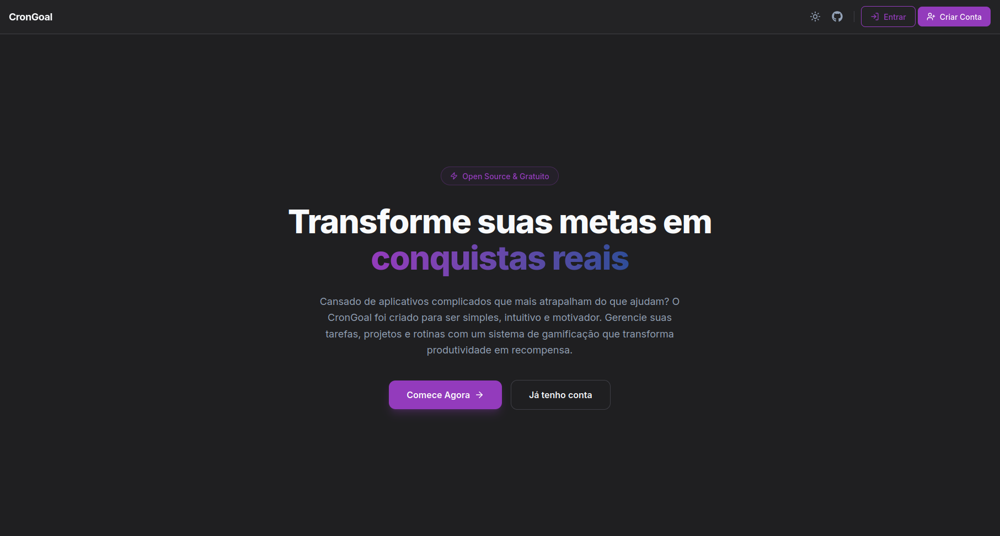
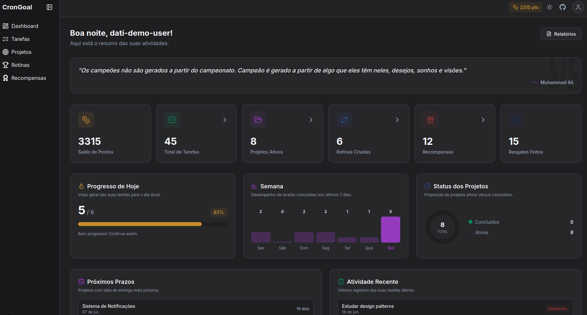
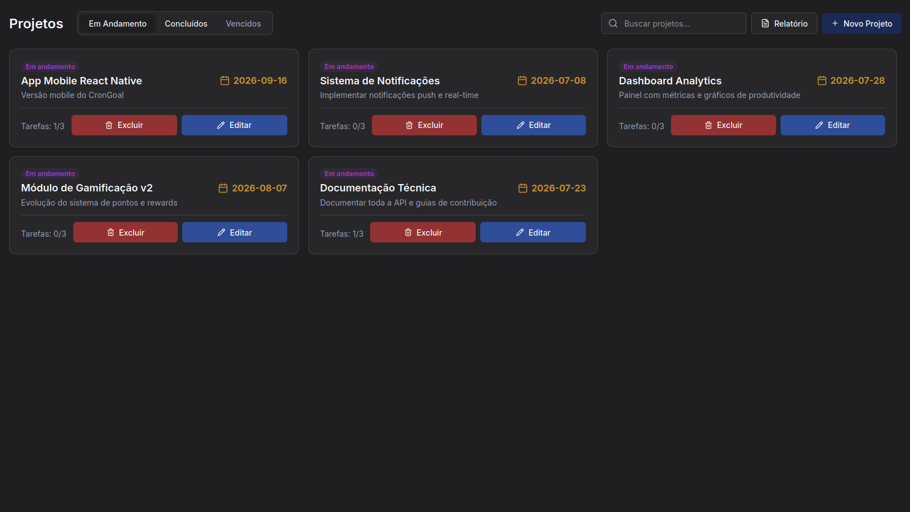
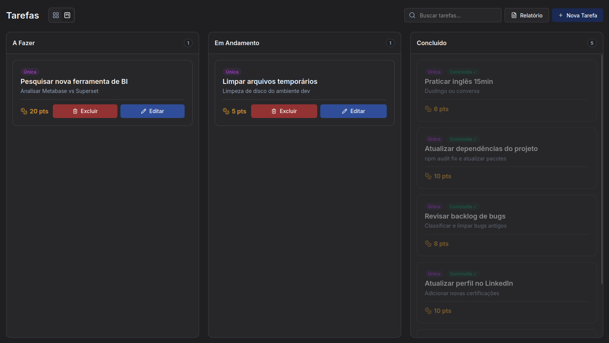
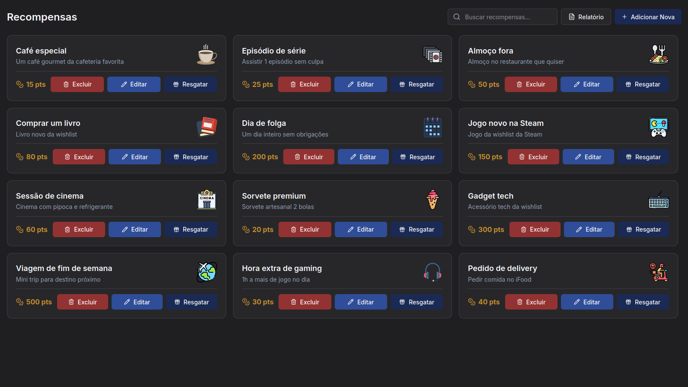
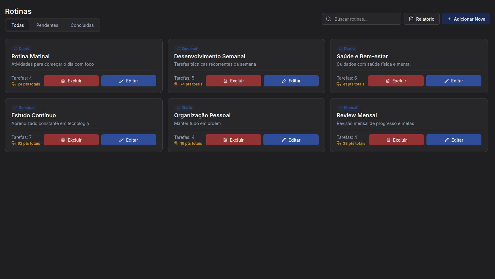
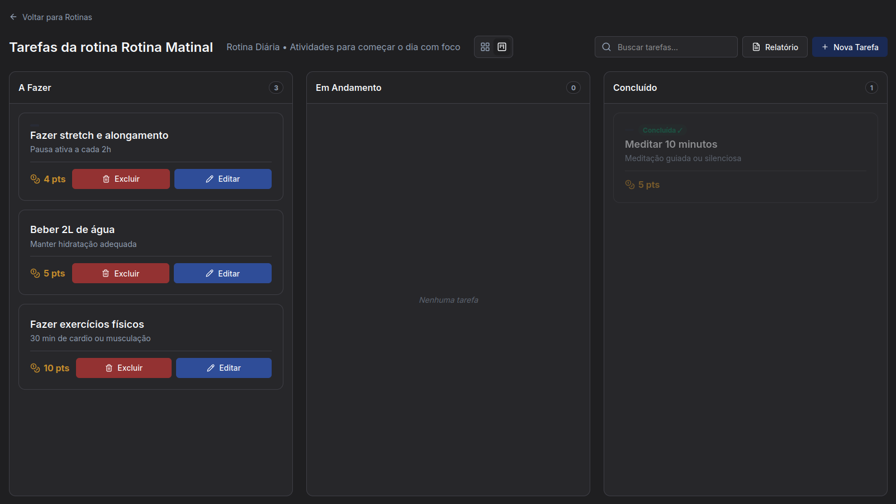
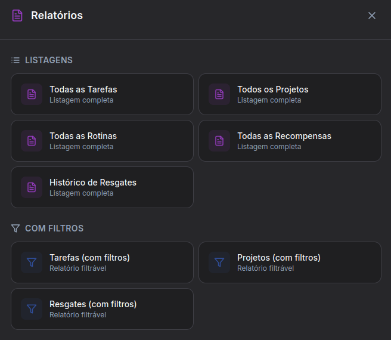
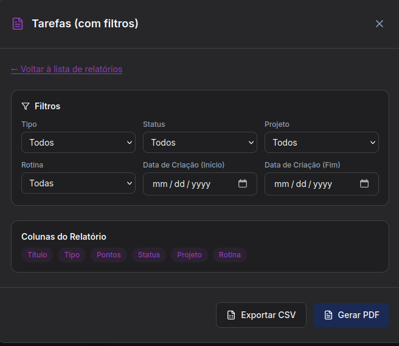

> 🇺🇸 [View in English](README-en.md) · 🔗 [Ver Backend](https://github.com/matbdev/dpa-crongoal-backend)

# CronGoal — Aplicação open source de acompanhamento de metas, feita por e para você!


> Interface web completa do ecossistema CronGoal — construída com Next.js (App Router) + React + TypeScript, focada em experiência de usuário, responsividade e integração total com a API backend.

---

## O que é

O CronGoal é uma aplicação de produtividade pessoal gamificada que ajuda o usuário a organizar tarefas, rotinas e projetos de forma visual e intuitiva. Este repositório contém o **frontend web** — a interface que o usuário vê e interage diretamente.

Se você já tentou tomar controle da sua rotina mas nunca encontrou uma ferramenta simples o suficiente para isso, esse projeto foi feito pra você. A proposta é eliminar a complexidade desnecessária e entregar uma experiência direta — sem ficar mais tempo configurando a ferramenta do que realmente gerenciando suas metas.

## Por que existe

Esse projeto nasceu dentro da disciplina de **Desenvolvimento de Aplicações para a Internet (DAI)** na **UNIVATES**, mas vai além de uma entrega acadêmica. A motivação real veio da frustração com ferramentas de produtividade que ou são simples demais e não sustentam uso real, ou são tão complexas que viram um obstáculo a mais.

O CronGoal preenche esse espaço: é robusto o bastante para acompanhar projetos com Kanban, rotinas periódicas e um sistema de recompensas gamificado — mas sem exigir do usuário uma curva de aprendizado absurda. A ideia é que ele funcione como um aliado no dia a dia, não como mais uma obrigação.

## Como funciona

- **Linguagem principal:** TypeScript
- **Framework / Runtime:** Next.js 16 (App Router) sobre React 19
- **Estilização:** Tailwind CSS 4 via PostCSS
- **Validação:** Zod (schemas espelhados do backend) + React Hook Form
- **Estado global:** React Context (`PointsContext`) para gamificação em tempo real
- **Integração API:** Camada de serviços abstraída via Axios com client centralizado (`lib/api.ts`)
- **Relatórios:** Geração programática de PDF (pdfmake) e exportação CSV com filtros avançados
- **Tema:** Suporte a dark/light mode via `next-themes`

### Estrutura do projeto

```
app/                    # Páginas e layouts do Next.js App Router
├── (auth)/             # Rotas de autenticação (login, registro, logout)
├── (dashboard)/        # Rotas protegidas (projetos, tarefas, recompensas, rotinas)
├── favicon.ico
├── globals.css         # Estilos globais (imports Tailwind)
├── layout.tsx          # Layout raiz
├── page.tsx            # Landing page
└── providers.tsx       # Providers globais de contexto React
components/             # Componentes React modulares e reutilizáveis
├── auth/               # Formulários de autenticação (Login, Registro)
├── dashboard/          # Componentes específicos do dashboard
├── home/               # Componentes da landing page (Features, Steps, Values)
├── kanban/             # Board Kanban, colunas e cards
├── layout/             # Navbar, Sidebar, PopUps, Toasters, AuthGuards
├── projects/           # Componentes de projetos
├── rewards/            # Componentes de recompensas
├── routines/           # Componentes de rotinas
├── tasks/              # Componentes de tarefas
└── ui/                 # Elementos atômicos de UI (Badges, Buttons, etc.)
contexts/               # Providers de contexto React
└── PointsContext.tsx   # Estado global dos pontos de gamificação
lib/                    # Bibliotecas utilitárias
└── api.ts              # Client HTTP centralizado (Axios)
schemas/                # Schemas de validação Zod (espelho do backend)
├── auth.schema.ts
├── kanban.schema.ts
└── ...
services/               # Wrappers de chamadas à API organizados por domínio
├── auth.service.ts
├── kanban.service.ts
└── ...
types/                  # Definições de tipos TypeScript
├── kanban.ts
├── project.ts
└── ...
```

## Como rodar localmente

### Pré-requisitos

- [Node.js](https://nodejs.org/) v18+
- Instância do **Backend CronGoal** rodando (veja o [repositório do backend](https://github.com/matbdev/dpa-crongoal-backend))

### Passos

```bash
# 1. Clonar o repositório
git clone https://github.com/matbdev/dpa-crongoal-frontend.git
cd dpa-crongoal-frontend

# 2. Instalar dependências
npm install

# 3. Configurar variáveis de ambiente
cp .env.template .env.local
# Edite o .env.local com a URL do seu backend

# 4. Iniciar o servidor de desenvolvimento
npm run dev
```

Depois abre `http://localhost:5001` no navegador.

## Demonstração

| Screenshot | Descrição |
|:--:|:--|
|  | **Landing page** — Tela inicial com CTA e apresentação do produto |
|  | **Dashboard** — Visão geral com métricas, gráficos semanais e progresso diário |
|  | **Projetos** — Cards de projetos com status, prazo e contagem de tarefas |
|  | **Tarefas** — Board Kanban com colunas A Fazer, Em Andamento e Concluído |
|  | **Recompensas** — Catálogo de recompensas resgatáveis com custo em pontos |
|  | **Rotinas** — Listagem de rotinas com periodicidade e total de tarefas |
|  | **Tarefas da rotina** — Kanban interno de uma rotina específica |
|  | **Relatórios** — Modal com opções de listagem completa e relatórios filtráveis |
|  | **Exportação** — Filtros avançados para gerar PDF ou CSV de tarefas |

## Decisões técnicas

- **Next.js App Router em vez de Pages Router:** A adoção do App Router foi intencional para aproveitar Server Components, layouts aninhados e a organização natural por rotas. A pasta `(auth)` e `(dashboard)` usam route groups para separar layouts sem afetar a URL.

- **Tailwind CSS 4:** A escolha pelo Tailwind veio da velocidade de prototipação e da consistência visual. O design system inteiro é baseado em utility classes, o que elimina a necessidade de CSS custom para a maioria dos componentes e mantém o bundle enxuto.

- **Zod espelhado do backend:** Os schemas de validação do frontend replicam exatamente os DTOs do backend. Isso garante que um formulário que passa na validação local vai ser aceito pela API sem surpresas. A integração com React Hook Form via `@hookform/resolvers` torna isso transparente.

- **PointsContext como estado global:** Em vez de usar uma lib de state management (Redux, Zustand), o sistema de pontos usa um Context simples. O motivo: o CronGoal precisa de pouquíssimo estado global — basicamente só o saldo de pontos. Adicionar uma lib inteira seria overengineering.

- **Geração de relatórios no frontend:** A decisão de gerar PDFs e CSVs direto no cliente (via `pdfmake`) foi proposital. Isso evita carga extra no backend, permite filtros dinâmicos sem roundtrips adicionais, e dá ao usuário controle total sobre o que exportar antes de gerar o arquivo.

- **Gamificação como feature de primeira classe:** O sistema de pontos e recompensas não foi um "nice to have" — foi projetado desde o início como parte central da experiência. Cada tarefa concluída gera pontos; cada recompensa resgatada deduz pontos. O histórico de resgates é rastreado por completo.

## Próximos passos

- [ ] Testes E2E com Playwright para fluxos críticos
- [ ] Modo offline com Service Worker e cache local
- [ ] Notificações push para rotinas pendentes
- [ ] Deploy em produção com CI/CD
- [ ] Internacionalização (i18n)

## Sobre

Feito por **Mateus Carniel Brambilla** ([@matbdev](https://github.com/matbdev))
durante a disciplina de Desenvolvimento de Aplicações para a Internet (DAI) na UNIVATES.

Submetido ao [`git show 2026`](https://jeferson-scheibler.github.io/git-show-dati/),
iniciativa do Diretório Acadêmico de Tecnologia da Informação (DATI)
da UNIVATES.

[](https://jeferson-scheibler.github.io/git-show-dati/)
