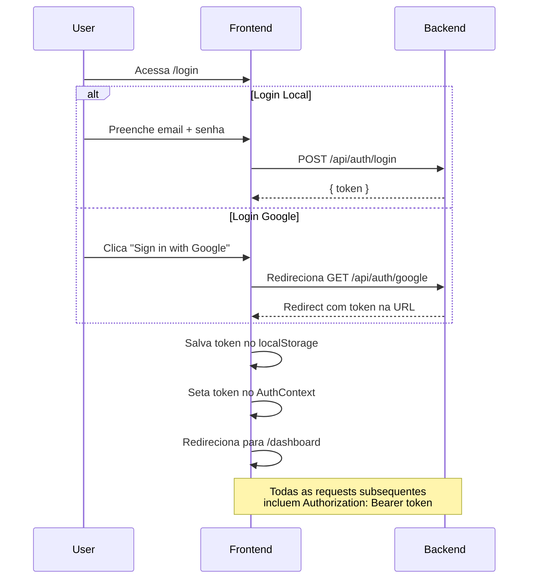

# Estrutura do Frontend — CronGoal

## Contexto

O backend CronGoal é uma API REST Express.js com autenticação JWT (login local + Google OAuth), RBAC, e as seguintes entidades: **User, Project, Task, KanbanColumn, Reward, Routine**. O frontend já tem um projeto Next.js 16 criado com Tailwind CSS v4 e App Router. Precisamos definir uma estrutura profissional e escalável.

---

## Estrutura Proposta de Pastas

```
dpa-crongoal-frontend/
├── app/                            # ← App Router (páginas e layouts)
│   ├── layout.tsx                  # Layout raiz (providers globais)
│   ├── page.tsx                    # Landing / redirect para dashboard
│   ├── globals.css                 # Estilos globais + tokens Tailwind
│   │
│   ├── (auth)/                     # Route group — páginas públicas (sem sidebar)
│   │   ├── layout.tsx              # Layout limpo (sem navbar/sidebar)
│   │   ├── login/page.tsx
│   │   └── register/page.tsx
│   │
│   └── (dashboard)/                # Route group — páginas protegidas
│       ├── layout.tsx              # Layout com Sidebar + Navbar + AuthGuard
│       ├── dashboard/page.tsx      # Visão geral (tarefas do dia, pontos, etc.)
│       ├── projects/
│       │   ├── page.tsx            # Lista de projetos
│       │   └── [id]/
│       │       └── page.tsx        # Kanban board do projeto
│       ├── tasks/page.tsx          # Lista/gestão de tarefas
│       ├── routines/page.tsx       # Lista de rotinas
│       ├── rewards/page.tsx        # Loja de recompensas
│       └── settings/page.tsx       # Configurações do perfil
│
├── components/                     # ← Componentes reutilizáveis
│   ├── ui/                         # Componentes atômicos (Button, Input, Modal, Card, Badge...)
│   │   ├── Button.tsx
│   │   ├── Input.tsx
│   │   ├── Modal.tsx
│   │   ├── Card.tsx
│   │   ├── Badge.tsx
│   │   ├── Spinner.tsx
│   │   └── index.ts                # Re-exports
│   ├── layout/                     # Componentes estruturais
│   │   ├── Sidebar.tsx
│   │   ├── Navbar.tsx
│   │   └── AuthGuard.tsx           # Redireciona se não autenticado
│   ├── kanban/                     # Componentes do Kanban
│   │   ├── KanbanBoard.tsx
│   │   ├── KanbanColumn.tsx
│   │   └── KanbanCard.tsx
│   ├── tasks/                      # Componentes de tarefas
│   │   ├── TaskList.tsx
│   │   ├── TaskCard.tsx
│   │   └── TaskForm.tsx
│   ├── rewards/                    # Componentes de recompensas
│   │   ├── RewardCard.tsx
│   │   └── RedeemModal.tsx
│   └── routines/                   # Componentes de rotinas
│       ├── RoutineCard.tsx
│       └── RoutineTaskList.tsx
│
├── lib/                            # ← Utilitários, configurações, lógica pura
│   ├── api.ts                      # Instância do fetch/axios configurada (baseURL, interceptors JWT)
│   ├── auth.ts                     # Helpers de token (getToken, setToken, removeToken)
│   └── utils.ts                    # Funções utilitárias genéricas (formatDate, cn, etc.)
│
├── services/                       # ← Camada de comunicação com a API (1 arquivo por entidade)
│   ├── auth.service.ts             # login, register, googleLogin
│   ├── user.service.ts             # getMe, updateProfile, deleteAccount
│   ├── project.service.ts          # getAll, getById, create, update, delete
│   ├── task.service.ts             # getAll, getById, create, update, delete, move, daily
│   ├── kanban.service.ts           # getByProject, getById, create, update, delete
│   ├── reward.service.ts           # getAll, getById, create, update, delete, redeem, getRedeems
│   └── routine.service.ts          # getAll, getById, create, update, delete, addTask, removeTask
│
├── types/                          # ← Tipagens TypeScript
│   ├── user.ts                     # User, Theme
│   ├── project.ts                  # Project
│   ├── task.ts                     # Task, TaskType, DailyRegister
│   ├── kanban.ts                   # KanbanColumn
│   ├── reward.ts                   # Reward, RedeemHistory
│   ├── routine.ts                  # Routine, RoutineTask
│   └── api.ts                      # ApiError, ApiResponse genéricos
│
├── hooks/                          # ← Custom hooks React
│   ├── useAuth.ts                  # Hook que acessa o AuthContext
│   ├── useProjects.ts              # Hook com fetch + cache de projetos
│   ├── useTasks.ts
│   ├── useRewards.ts
│   └── useRoutines.ts
│
├── contexts/                       # ← React Context providers
│   ├── AuthContext.tsx              # Gerencia user logado, token, login/logout
│   └── ThemeContext.tsx             # Gerencia tema DARK/LIGHT
│
├── public/                         # Assets estáticos
├── next.config.ts
├── tsconfig.json
├── package.json
└── .env.local                      # Variáveis de ambiente do frontend
```

---

## Explicação de Cada Camada

### 1. `app/` — Rotas (App Router)

O Next.js App Router usa a convenção de pastas para definir rotas. Usamos **Route Groups** `(auth)` e `(dashboard)` para separar layouts:

- `(auth)` → Layout sem sidebar, para quem não está logado
- `(dashboard)` → Layout com sidebar/navbar, protegido pelo `AuthGuard`

> [!IMPORTANT]
> Route Groups (pastas com parênteses) **não afetam a URL**. `(dashboard)/projects/page.tsx` vira `/projects`.

### 2. `components/` — Componentes Reutilizáveis

Organizados por **domínio** (kanban, tasks, rewards) e por **tipo** (ui = atômicos, layout = estruturais). Isso evita uma pasta plana com 50+ arquivos.

### 3. `lib/` — Configuração Base

- **`api.ts`**: Cria uma instância centralizada (usando `fetch` nativo ou `axios`) que automaticamente:
  - Adiciona `Authorization: Bearer <token>` em toda request
  - Redireciona para `/login` em caso de 401
  - Aponta para `process.env.NEXT_PUBLIC_API_URL`
  
- **`auth.ts`**: Funções para salvar/ler o JWT do `localStorage`
- **`utils.ts`**: Funções auxiliares

### 4. `services/` — Comunicação com a API

Cada arquivo encapsula **todas as chamadas HTTP** de uma entidade. Exemplo:

```ts
// services/project.service.ts
import { api } from '@/lib/api';
import { Project } from '@/types/project';

export const projectService = {
  getAll: () => api.get<Project[]>('/api/project'),
  getById: (id: string) => api.get<Project>(`/api/project/${id}`),
  create: (data: Partial<Project>) => api.post<Project>('/api/project', data),
  update: (id: string, data: Partial<Project>) => api.put<Project>(`/api/project/${id}`, data),
  delete: (id: string) => api.delete(`/api/project/${id}`),
};
```

### 5. `types/` — Tipagens

Interfaces TypeScript espelhando os modelos do backend. Mantém o código type-safe.

### 6. `hooks/` — Custom Hooks

Encapsulam lógica de fetch + estado. Se no futuro você adotar React Query (TanStack Query), esses hooks serão o ponto de integração.

### 7. `contexts/` — Estado Global

- **AuthContext**: Guarda o `user` logado e o `token`. Provê funções `login()`, `logout()`, `register()`.
- **ThemeContext**: Aplica o tema DARK/LIGHT conforme preferência do usuário.

---

## Dependências a Instalar

| Pacote | Motivo |
|:--|:--|
| `axios` | Client HTTP mais ergonômico que fetch (interceptors, baseURL, timeout) |
| `react-icons` | Ícones prontos (Lucide, Feather, etc.) |
| `@hello-pangea/dnd` | Drag & Drop para o Kanban Board |
| `react-hot-toast` | Notificações toast minimalistas |
| `clsx` | Concatenação condicional de classes CSS |

> [!NOTE]
> Todas as dependências são opcionais e podem ser substituídas. O `axios` por exemplo pode ser trocado por um wrapper de `fetch` nativo se preferir menos dependências.

---

## Variáveis de Ambiente

```env
# .env.local
NEXT_PUBLIC_API_URL=http://localhost:5000
NEXT_PUBLIC_GOOGLE_AUTH_URL=http://localhost:5000/api/auth/google
```

> [!IMPORTANT]
> No Next.js, variáveis de ambiente que precisam ser acessadas no **browser** devem ter o prefixo `NEXT_PUBLIC_`.

---

## Fluxo de Autenticação



---

## Mapeamento Backend → Frontend

| Entidade Backend | Service Frontend | Página Principal | Componentes |
|:--|:--|:--|:--|
| Auth | `auth.service.ts` | `/login`, `/register` | LoginForm, RegisterForm |
| User | `user.service.ts` | `/settings` | ProfileCard, SettingsForm |
| Project | `project.service.ts` | `/projects`, `/projects/[id]` | ProjectCard, KanbanBoard |
| Task | `task.service.ts` | `/tasks`, embedded no Kanban | TaskCard, TaskForm, TaskList |
| KanbanColumn | `kanban.service.ts` | `/projects/[id]` | KanbanColumn, KanbanBoard |
| Reward | `reward.service.ts` | `/rewards` | RewardCard, RedeemModal |
| Routine | `routine.service.ts` | `/routines` | RoutineCard, RoutineTaskList |

---

## Decisões que Precisam da Sua Opinião

> [!IMPORTANT]
> **1. Tailwind CSS:** Seu projeto já está configurado com Tailwind v4. Quer continuar com Tailwind ou prefere CSS puro/vanilla?

> [!IMPORTANT]
> **2. Gerenciamento de estado:** Para a v1, proponho usar Context API + hooks customizados (mais simples). No futuro, se ficar complexo, migraria para Zustand ou TanStack Query. Concorda?

> [!IMPORTANT]
> **3. Idioma do app:** O backend foi escrito em inglês, o login page está em inglês. Quer manter o app inteiro em inglês ou trocar para português?

> [!IMPORTANT]
> **4. Escopo inicial:** Quer que eu implemente a estrutura inteira de uma vez (todas as pastas, services, types, contextos), ou prefere ir por módulos (ex: primeiro auth + dashboard, depois kanban, depois rewards)?

---

## Plano de Verificação

### Verificação automatizada
- `npm run build` — garantir que o projeto compila sem erros TypeScript
- `npm run dev` — verificar que todas as rotas renderizam corretamente no browser

### Verificação manual
- Testar o fluxo login → dashboard com o backend rodando
- Verificar que o AuthGuard redireciona corretamente
